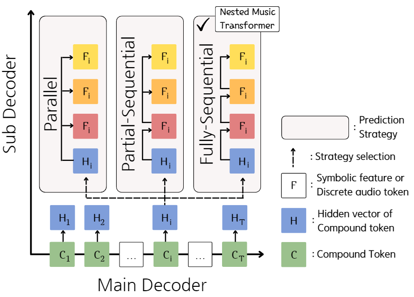
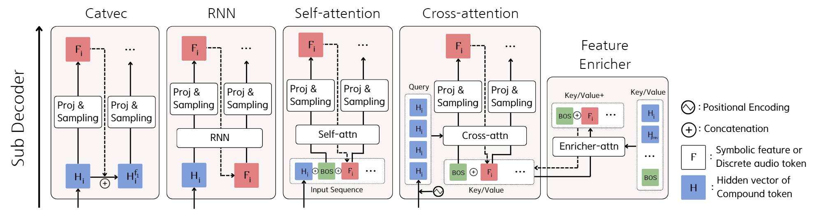

## Content

- [NMT Architecture](#architecture)
- [Generated Results](#generations)
  - [Best unconditioned generation samples](#best-unconditional)
  - [4-measure continuation comparison among models](#continuation)
  - [MAESTRO fine-tuned EnCodec token based continuated generation samples](#encodec)

---

## NMT Architecture {#architecture}

Diagram of the Nested Music Transformer
{:.center .larger}
 
 

Multiple architectures of the Nested Music Transformer
{:.center .larger}
 

> __Note__: All the samples are generated in single pass through the model using a sequence length of 1024. Thus, the generated music is usually shorter for a more complex ensemble than a simple ensemble.

---

## Generated Results {#generations}

### Best unconditioned generation samples {#best-unconditional}

> __Settings__: The results of unconditional generation from different models.

|  |  |  |  |
|  |  |  |  |

---
### 4-measure continuation comparison among models {#continuation}

> __Settings__: The model is given a 4-measure length of piece as prompt. The model then generates the note sequence.

|  | __Prompt 1__{:.center} | __Prompt 2__{:.center} |
| __REMI + flattening__ |  |  |
| __CP + Catvec__ |  |  |
| __CP + enricher__ |  |  |
| __NB-PF + enricher__ |  |  |
| __Ensemble__ |  |  |

---
### MAESTRO fine-tuned EnCodec token based continuated generation samples {#encodec}

> __Settings__: The model is given a 10-second length audio sample in EnCodec tokens. The model then generates the note sequence.

|  | __Prompt 1__{:.center} | __Prompt 2__{:.center} |
| __Parallel__ |  |  |
| __Flatten__ |  |  |
| __Delay__ |  |  |
| __Self_attn__ |  |  |
| __Cross_attn__ |  |  |
| __Enricher__ |  |  |

---