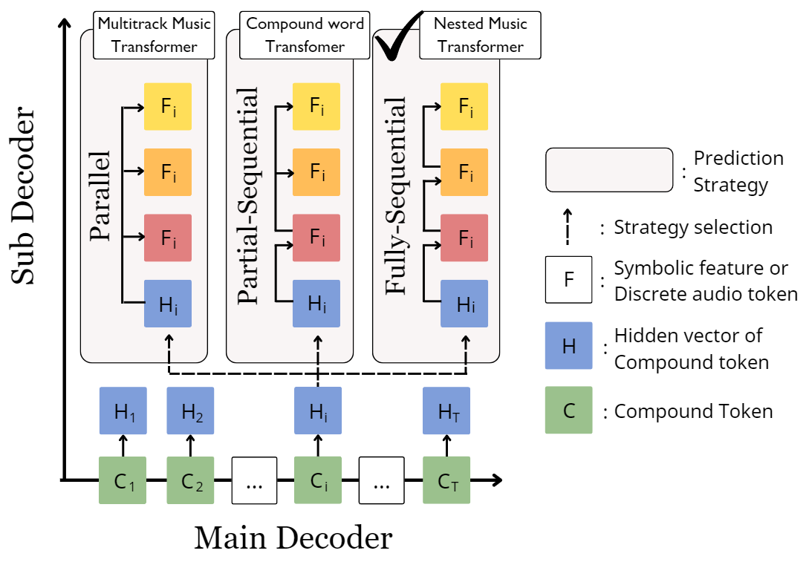
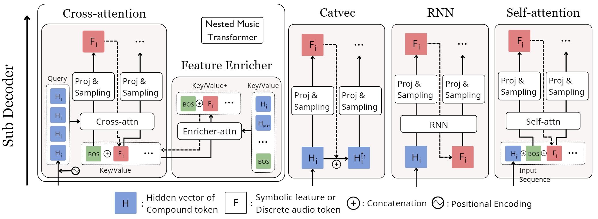
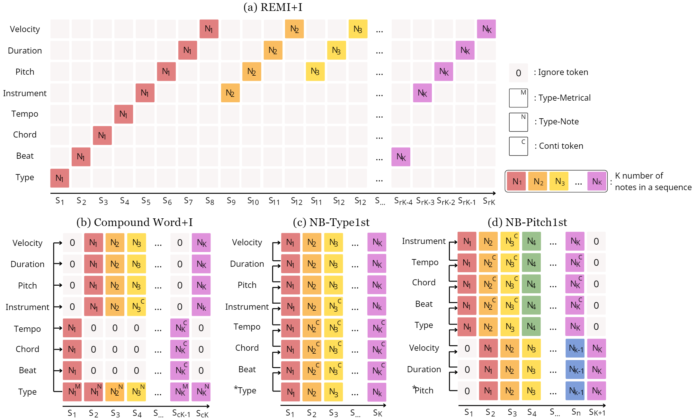
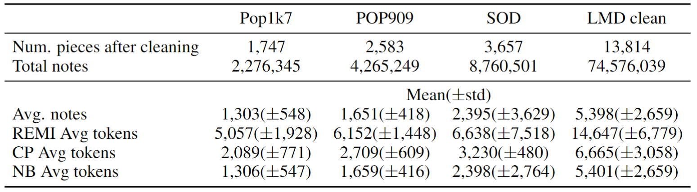
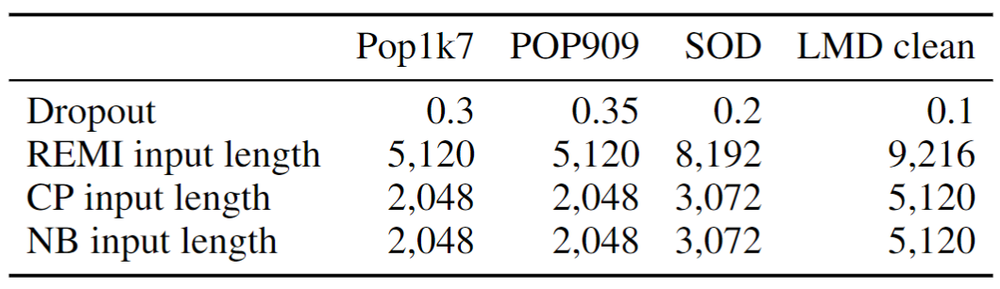
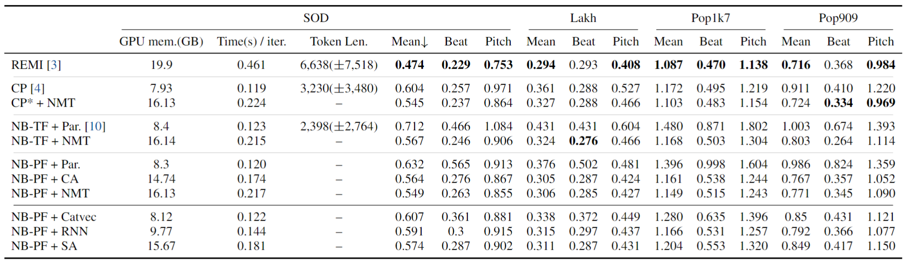

## Content
---
- [NMT Architecture](#architecture)
- [Encoding Comparison](#Encoding)
- [Results](#Tables)
- [Generated Results](#generations)
  - [Best unconditioned generation samples](#best-unconditional)
  - [4-measure continuation comparison among models](#continuation)
  - [MAESTRO fine-tuned EnCodec token based continuated generation samples](#encodec)

## NMT Architecture {#architecture}
---

Diagram of different prediction method in subdecoder.
{:.center .larger}
> __Note__: Our proposed Nested Music Transformer (NMT) predicts each feature in a fully-sequential manner, which is different from how the previous decoding architectures work.

 Illustrations of the proposed Nested Music Transformer (NMT) and other sub-decoder structures
{:.center .larger}
 

## Encoding Comparison {#Encoding}
---

An example illustrating proposed representations, note-based encoding (c) NB-Type1st and (d) NB-Pitch1st, alongside REMI and Compound word for the sake of comparison.
{:.center .larger}

> __Note__: All the encodings represent the same piece of music by utilizing 8 features. Specifically, REMI and Compound word weren’t designed for multi-instrument pieces. That’s why we renamed the encoding with “+I” to (a) and (b). However, the main ideas for these two encoding is reserved for (a) and (b). The piece has K number of notes in the representation. If we used F number of different features for the encoding, the scale factors between REMI;r, Compound word;c can be expressed as an inequality like followings: 1 < c <= 2  < r < F. c can reach up to 2 in the case where every notes are positioned differently (no simultaneous note played at the same time).

## Results {#Tables}
---

The statistics of the dataset used in the experiments.
{:.center .larger}
 

---

The hyperparameters used in the experiments for each dataset.
{:.center .larger}

---

The main results of the experiments for symbolic music generation. Comparison average NLL loss for each model.
{:.center .larger}

> __Note__: We used total 12 number of layers including number of main deocer layers, sub-decoder layers and feature-enricher layers in case it is utilized. All models are trained with 512 dimension of hidden size and 8 heads of multi-head attention.

## Generated Results {#generations}
---
### Best unconditioned generation samples {#best-unconditional}

> __Settings__: The results of unconditional generation from 4 different datasets are shown. The model is given a random seed with only Start-of-Suence (SOS) token and generates the note sequences.

|  | __Pop1k7__{:.center} | __Pop909__{:.center} | __SOD__{:.center} | __Lakh__{:.center} |
| --- | --- | --- | --- | --- |
| __REMI + flattening__ |  |  |  |  | 
|  |  |  |  |  | 
|  |  |  |  |  | 
| __NB-PF + enricher__ |  |  |  |  | 
|  |  |  |  |  | 
|  |  |  |  |  |

---
### 4-measure continuation comparison among models {#continuation}

> __Settings__: The model is given a 4-measure length symbolic tokens of selected pieces. The model then generates the note sequences. Selection of pieces for prompt is required as interesting motifs are needed for the continuation.

|  | __Prompt 1__{:.center} | __Prompt 2__{:.center} |
| __REMI + flattening__ |  |  |
| __CP + Catvec__ |  |  |
| __CP + enricher__ |  |  |
| __NB-PF + enricher__ |  |  |
| __Ensemble__ |  |  |

---
### MAESTRO fine-tuned EnCodec token based continuated generation samples {#encodec}

> __Settings__: The model is given a 10-second length audio sample in EnCodec tokens. The model then generates the note sequence.

|  | __Prompt 1__{:.center} | __Prompt 2__{:.center} |
| __Parallel__ |  |  |
| __Flatten__ |  |  |
| __Delay__ |  |  |
| __Self_attn__ |  |  |
| __Cross_attn__ |  |  |
| __Enricher__ |  |  |

